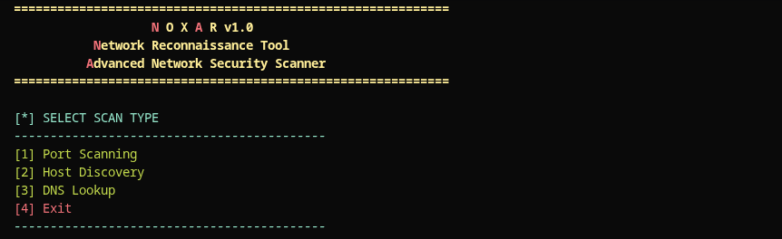

# NOXAR - Network Reconnaissance Tool

Fast and concurrent network reconnaissance tool written in Go. Performs port scanning, DNS resolution, and host discovery using goroutines and channels for parallel processing.

---

## Installation

### Requirements
- **Go 1.21+** ([Install Go](https://golang.org/doc/install))
- **Linux, macOS, or Windows (WSL2)**
- **Internet connection** (for DNS and port scanning)

### Step 1: Clone Repository
```bash
git clone https://github.com/KDRSMH/noxar.git
cd noxar
```

### Step 2: Choose Installation Method

**Option A: Automatic Installation (Recommended)**
```bash
bash install.sh
noxar  # Now available globally
```

**Option B: Manual Build**
```bash
make build
sudo make install
noxar
```

**Option C: Quick Run**
```bash
make run
./noxar
```

**Option D: Direct Go Execution**
```bash
go run ./cmd/gorecon
```

---

## Usage

### Start NOXAR
```bash
noxar
```



### Menu Options

```
[1] Port Scanning       - Scan ports on a target host
[2] Host Discovery     - Find online hosts in a network
[3] DNS Lookup         - Resolve domains or reverse DNS
[4] Exit               - Exit the program
```

### Example 1: Port Scanning
```
[>] 1
[>] Target IP: google.com
[>] Start Port: 1
[>] End Port: 1000
```
Shows open ports (80, 443, etc.)

### Example 2: Host Discovery
```
[>] 2
[>] Network CIDR: 192.168.1.0/24
[>] Port to Check: 80
```
Lists all online hosts with specified port open

### Example 3: DNS Lookup
```
[>] 3
[>] Enter IP or Domain: google.com
```
Shows IPv4 and IPv6 addresses

---

## Build & Development

```bash
make help       # Show all available commands
make build      # Build binary
make run        # Build and run
make test       # Run tests
make clean      # Clean build artifacts
make install    # Install globally
make uninstall  # Remove from system
make dev        # Build with race detector
```

---

## Architecture

```
noxar/
├── cmd/gorecon/main.go      # CLI interface
├── pkg/
│   ├── ports/scan.go        # Port scanning
│   ├── dns/dns.go           # DNS resolution
│   ├── hosts/hosts.go       # Host discovery
│   └── utils/results.go     # Result formatting
└── tests (scan_test.go, etc)
```

---

## Features

- **Parallel Port Scanning**: Up to 100 concurrent connections
- **DNS Resolution**: Forward and reverse lookup with IPv4/IPv6 support
- **Network Discovery**: CIDR range scanning to find active hosts
- **Interactive CLI**: Color-coded menu with real-time progress
- **Error Handling**: Comprehensive error management and retry logic

---

## Troubleshooting

### Error: "noxar: command not found"
```bash
source ~/.bashrc
```

### Error: "Go is not installed"
Visit [golang.org/doc/install](https://golang.org/doc/install)

### Port scanning is slow
- Try a smaller port range (1-100 instead of 1-65535)
- Network latency may increase scan time

### DNS lookup fails
- Check your internet connection
- The domain/IP might not resolve in your network

---

## License

MIT License

---

## Author

[Semih Kadir](https://www.linkedin.com/in/kadir-semih-yıldırım) | 2026
